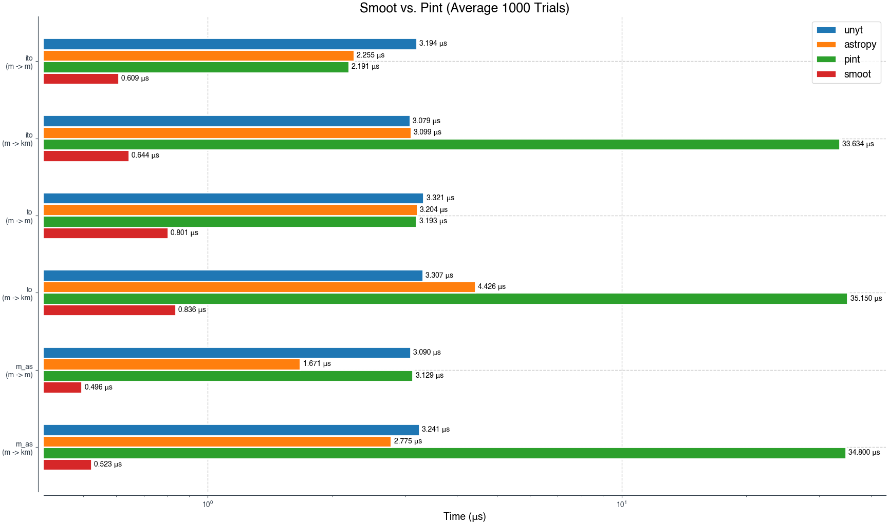
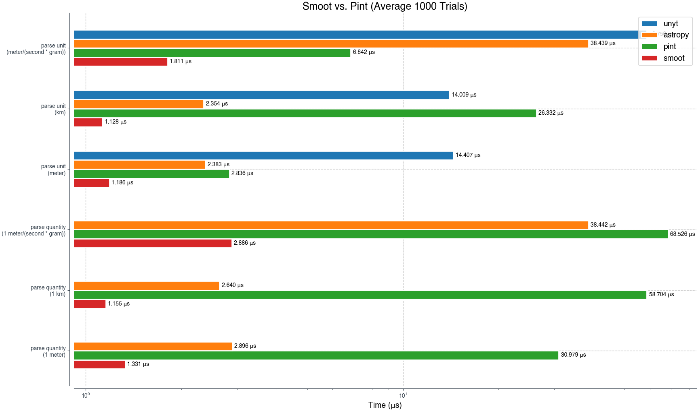
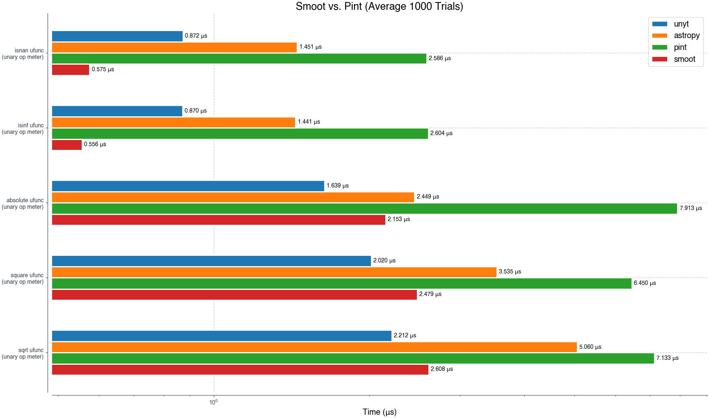
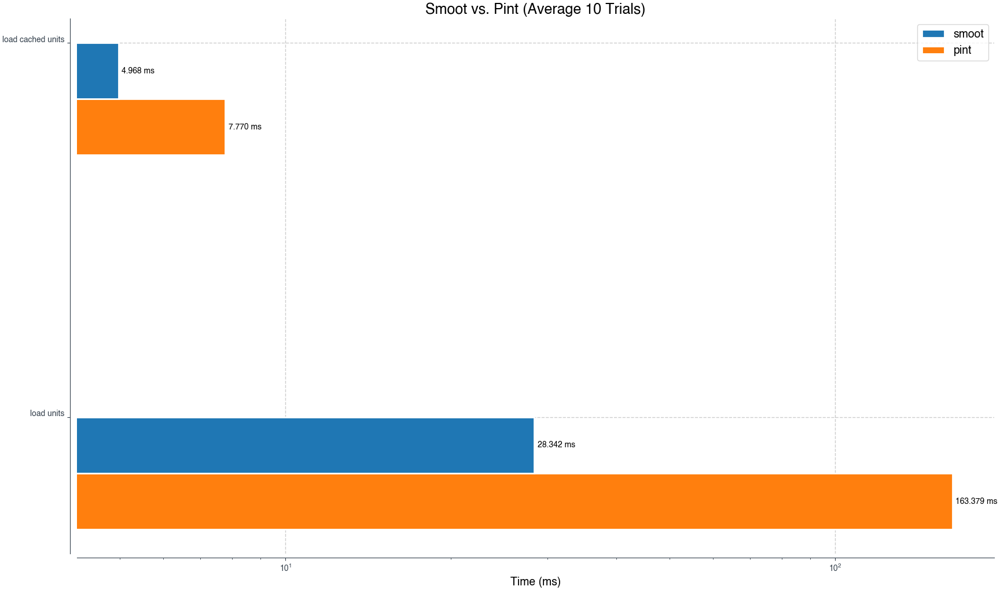

> [!CAUTION]
> Smoot is an early-stages project that has not reached a stable release. Bugs and missing features are a common occurrence. Breaking API changes can happen without notice. Features and bugs will be prioritized at the author's discretion.


## Smoot: A fast dimensional analysis library for Python

Smoot is a [dimensional analysis](https://en.wikipedia.org/wiki/Dimensional_analysis) library written in Rust that allows numeric operations between and conversions to and from physical units.

It is designed as a drop-in replacement for [Pint](https://github.com/hgrecco/pint) with notably better performance. Smoot is 9-10x faster on average than Pint! See [Performance](#performance) below for more details.


## Basic Usage

Smoot supports Python 3.8+.

The API is identical to [Pint](https://github.com/hgrecco/pint)
```python
>>> import smoot
>>> units = smoot.UnitRegistry()
>>> 3 * units.meter + 4 * units.cm
<Quantity('3.04 meter')>
```

Smoot also supports numpy
```python
>>> [3, 4] * units.meter + [4, 3] * units.cm
<Quantity('[3.04, 4.03] meter')>
>>> np.sum(_)
<Quantity('7.07 meter')>
```

See [Usage](#usage) below for more.


## Installation

> [!CAUTION]
> Smoot is not yet available in prebuilt form on [PyPI](https://pypi.org/). You need to build the library from source.

Install the Rust toolchain for 1.86+. It is suggested to use [rustup](https://rustup.rs/).

Once you have Rust installed, you can use pip install to automatically build Smoot for your system:
```shell
pip install git+https://github.com/j-helland/smoot.git
```

Verify your installation with
```shell
python -c "import smoot"
```

### Building Wheels

One can easily build a redistributable [wheel](https://peps.python.org/pep-0427/) using the [Maturin](https://www.maturin.rs/) build system. Assuming that you already have `pip install maturin`, 
```shell
maturin build -r --strip --target <cpu-target>
```
where e.g. `aarch64-apple-darwin` is the correct choice for Apple silicon.


## Usage

### Unit Algebra

One of the most important features of Smoot is the ability to correctly track units throughout algebraic computations.
```python
>>> import smoot
>>> units = smoot.UnitRegistry()
>>> Q = units.Quantity

>>> e = Q(1, "gram") * units.c ** 2
>>> e
<Quantity('1 gram * speed_of_light ** 2')>

>>> e.to_root_units()
<Quantity('89875517873681760 (gram * meter ** 2) / second ** 2')>
```

### Unit Conversions

Smoot can convert compatible physical quantities.
```python
>>> Q(1, "meter").to("km")
<Quantity('0.001 kilometer')>

>>> Q(1, "meter").to("km").to("m")
<Quantity('1 meter')>
```

Moreover, Smoot will protect you from converting between physically incompatible units:
```python
>>> Q(1, "meter").to("gram")
Traceback (most recent call last):
...
"smoot.smoot".SmootError: Incompatible unit types meter and gram
```

Compatibility can be checked
```python
>>> Q(1, "meter").units.is_compatible_with("km")
True

>>> Q(1, "meter").u.is_compatible_with("gram")
False
```

### Unwrapping Quantities

You can extract values from quantities:
```python
>>> Q(1, "meter").magnitude
1.0

>>> Q(1, "meter").m
1.0
```

> [!NOTE]
> Smoot currently only supports floating point numerical data in its backend. As such, magnitudes will always return as floats (or `np.float64` in the case of arrays).

### Numpy Arrays

> [!CAUTION]
> The current implementation of Smoot requires copying numpy arrays to and from the underlying Rust code depending on the operation. This is reasonably fast for small arrays but the overhead can become expensive for large arrays (> 1k entries).
> Improving this situation is on the roadmap.

> [!CAUTION]
> While all [ufuncs](https://numpy.org/doc/stable/reference/ufuncs.html) are implemented, [higher order array functions](https://numpy.org/neps/nep-0018-array-function-protocol.html) are still a work in progress. Expect some inconsistencies here as Smoot stabilizes.

Smoot supports seamless integration with [Numpy](https://numpy.org/). Any iterable type passed into Smoot will be converted into a Numpy array.
```python
>>> units = smoot.UnitRegistry()
>>> q = [1, 2, 3] * units.meter
>>> q
<Quantity('[1, 2, 3] meter')>

>>> q.magnitude
array([1., 2., 3.])
```

Numpy functions are supported for all quantities, and units are retained when appropriate:
```python
>>> Q = units.Quantity
>>> np.sqrt(Q(2, "meter"))
<Quantity('1.4142135623730951 meter ** 0.5')>

>>> np.sqrt(Q([1, 2, 3], "meter"))
<Quantity('[1, 1.4142135623730951, 1.7320508075688772] meter ** 0.5')>

>>> np.sum(_)
<Quantity('4.146264369941973 meter ** 0.5')>
```

### Custom Units

> [!CAUTION]
> Smoot supports most of [Pint's unit definition syntax](https://pint.readthedocs.io/en/stable/advanced/defining.html) but some features are not yet implemented. 
> - Smoot does not support any `@` syntax like `@alias`, `@group`, `@context`, and `@system`.
> - Smoot does not support custom conversions e.g. `[gaussian_charge] -> [charge]: value / k_C ** 0.5`.

The existing unit registry can be extended with custom units
```python
>>> units = smoot.UnitRegistry()
>>> units.load_definitions("my_cool_unit = 10 * smoot")
>>> units.my_cool_unit
<Unit('my_cool_unit')>

>>> (1 * units.my_cool_unit).to(units.smoot)
<Quantity('10 smoot')>
```

Custom prefixes can also be defined, although they will only apply to newly defined units.
```python
>>> units = smoot.UnitRegistry()
>>> units.load_definitions("""
... my_prefix- = 2
... my_cool_unit = 10 * smoot
... """)

>>> units.my_cool_unit
<Unit('my_cool_unit')>

# Existing prefixes apply to custom units.
>>> units.kilomy_cool_unit
<Unit('kilomy_cool_unit')>

>>> units.my_prefixmy_cool_unit
<Unit('my_prefixmy_cool_unit')>

# But custom prefixes don't apply to existing units.
>>> units.my_prefixmeter
Traceback (most recent call last):
...
"smoot.smoot".SmootError: Invalid unit expression my_prefixmeter
```

It is also possible to create a unit registry from scratch containing only your custom unit definitions:
```python
>>> units = smoot.UnitRegistry(data="""
... my_prefix- = 2
... my_cool_unit = [my_dimension]
... my_cooler_unit = 10 * my_cool_unit
... """)

>>> units.my_cool_unit
<Unit('my_cool_unit')>

>>> units.my_cooler_unit
<Unit('my_cooler_unit')>

>>> units.my_cooler_unit.dimensionality
{'[my_dimension]': 1.0}
```


<!-- ## Performance

> [!NOTE]
> All benchmark results were obtained on a MacBook Pro M4 Max using `Python 3.8.20`, `Pint 0.21.1`, `Astropy 5.2.2`, and `Unyt 2.9.5`. 
>
> Results are similar for `Python 3.13.2`, `Pint 0.24.4`, `Astropy 7.0.1`, and `Unyt 3.0.4`.

Smoot typically outperforms other popular dimensional analysis libraries in the Python ecosystem: [Pint](https://github.com/hgrecco/pint), [Astropy units](https://github.com/astropy/astropy), and [Unyt](https://github.com/yt-project/unyt/tree/main). 

Across all measured operations, Smoot averages (geometric mean) about 10x faster than Pint and Unyt, and about 3x faster than Astropy.

### Unit Conversions

Smoot averages about 15x faster unit conversions than Pint and 4-5x faster than astropy and unyt.

| speedup factor | Average (geometric) | Median | Max | Min |
| --- | ---                 | ---    | --- | --- |
| **vs pint**    | 15.379 +/- 3.933 | 24.178 +/- 20.384 | 66.557 | 3.6 |
| **vs astropy** | 4.347  +/- 1.213 | 4.405  +/- 0.795  | 5.307  | 3.368 |
| **vs unyt**    | 5.014  +/- 1.214 | 5.013  +/- 0.961  | 6.227  | 3.956 |





| function         | conversion  | pint (μs) | smoot (μs) | speedup factor |
| ----             | ----------- | --------- | ---------- | -------------- |
| `m_as`           | `m -> km`   | 8.491     | 0.175      | **48.330**     |
| `m_as`           | `m -> m`    | 2.503     | 0.166      | **15.009**     |
| `to`             | `m -> km`   | 8.401     | 0.335      | **25.056**     |
| `to`             | `m -> m`    | 2.439     | 0.294      | **8.272**      |
| `ito`            | `m -> km`   | 1.371     | 0.175      | **7.798**      |
| `ito`            | `m -> m`    | 1.359     | 0.178      | **7.615**      |
| `to_root_units`  | `m`         | 2.965     | 0.243      | **12.157**     |
| `to_root_units`  | `km`        | 8.581     | 0.239      | **35.862**     | 
| `to_root_units`  | `newton`    | 10.393    | 0.343      | **30.248**     |
| `ito_root_units` | `m`         | 1.877     | 0.125      | **15.021**     |
| `ito_root_units` | `km`        | 1.871     | 0.123      | **15.128**     |
| `ito_root_units` | `newton`    | 1.568     | 0.197      | **7.947**      |


### Expression String Parsing

Smoot averages about 13.5x faster expression string parsing than Pint, 4x faster than Astropy, and 17x faster than Unyt.

Note that in the version of Unyt used for this benchmark, there is no quantity string parsing (e.g. `'1 meter'`) so Unyt is excluded from those comparisons.


| speedup factor | Average (geometric) | Median | Max | Min |
| --- | ---                 | ---    | --- | --- |
| **vs pint**    | 13.450 | 3.345 | 23.311 | 9.984 | 50.820 | 2.390  |
| **vs astropy** | 4.250  | 2.933 | 2.230  | 0.182 | 21.222 | 2.009  |
| **vs unyt**    | 16.976 | 1.752 | 12.419 | 0.273 | 32.435 | 12.146 |




| name|description|smoot (μs)|pint (μs)|astropy (μs)|unyt (μs)|speedup (vs pint)|speedup (vs astropy)|speedup (vs unyt) |
| --- | --- | --- | --- | --- | --- | --- | --- | --- |
| parse quantity | `1 meter` | 1.331 | 30.979 | 2.896 | N/A | 23.277 x | 2.176 x | N/A |
| parse quantity | `1 km` | 1.155 | 58.704 | 2.640 | N/A | 50.820 x | 2.285 x | N/A |
| parse quantity | `1 meter/(second * gram)` | 2.886 | 68.526 | 38.442 | N/A | 23.746 x | 13.321 x | N/A |
| parse unit | `meter` | 1.186 | 2.836 | 2.383 | 14.407 | 2.391 x | 2.009 x | 12.146 x |
| parse unit | `km` | 1.128 | 26.332 | 2.354 | 14.009 | 23.345 x | 2.087 x | 12.420 x |
| parse unit | `meter/(second * gram)` | 1.811 | 6.842 | 38.439 | 58.750 | 3.777 x | 21.222 x | 32.436 x |


### Pickle

Smoot quantities pickle and unpickle faster than Pint. In particular, Smoot quantities unpickle about **14x** faster.


| name|smoot (μs)|pint (μs)|astropy (μs)|unyt (μs)|speedup (vs pint)|speedup (vs astropy)|speedup (vs unyt) |
| --- | --- | --- | --- | --- | --- | --- | --- |
| `pickle.dump` | 1.687 | 2.735 | 4.614 | 144.418 | **1.621 x** | **2.735 x** | **85.604 x** |
| `pickle.load` | 7.590 | 181.128 | 3.532 | 352.720 | **23.865 x** | **0.465 x** | **46.473 x** |


### Arithmetic

Smoot quantities are about 23x faster at arithmetic than Pint and about 10-12x faster than astropy and unyt, even with implicit unit conversions e.g. `'1 m' + '1 cm'`.

| speedup factor | Average (geometric) | Median | Max | Min |
| --- | ---                 | ---    | --- | --- |
| vs pint | 23.126 +/- 1.679 | 27.543 +/- 9.543 | 38.155 | 12.1 |
| vs astropy | 10.924 +/- 1.368 | 11.165 +/- 2.061 | 14.732 | 6.207  |
| vs unyt |    12.550 +/- 1.454 | 11.949 +/- 3.291 | 19.342 | 7.543    |


| name|smoot (μs)|pint (μs)|astropy (μs)|unyt (μs)|speedup (vs pint)|speedup (vs astropy)|speedup (vs unyt) |
| --- | --- | --- | --- | --- | --- | --- | --- |
| `eq` | 0.320 | 8.526 | 1.989 | 3.116 | **26.648 x** | **6.217 x** | **9.738 x** |
| `add` | 0.399 | 14.704 | 4.439 | 4.395 | **36.864 x** | **11.129 x** | 1**1.019 x** |
| `sub` | 0.386 | 14.531 | 4.068 | 4.535 | **37.669 x** | **10.545 x** | 1**1.756 x** |
| `mul` | 0.430 | 5.068 | 6.108 | 3.161 | **11.783 x** | **14.201 x** | **7.349 x** |
| `truediv` | 0.443 | 5.288 | 6.031 | 8.196 | **11.938 x** | **13.614 x** | 1**8.502 x** |
| `floordiv` | 0.442 | 13.006 | 4.479 | 8.309 | **29.423 x** | **10.133 x** | 1**8.797 x** |


### Numpy ufuncs

Smoot is competitive for Numpy ufunc invocations on scalar values at about 3.5x faster than Pint, 1.8x faster than astropy, and about the same as unyt.

| speedup factor | Average (geometric) | Median | Max | Min |
| --- | ---                 | ---    | --- | --- |
| vs pint    | 3.533 +/- 1.314 | 3.675 +/- 0.940 | 4.683 | 2.601 |
| vs astropy | 1.831 +/- 1.432 | 1.940 +/- 0.584 | 2.591 | 1.137 |
| vs unyt    | 1.045 +/- 1.428 | 0.848 +/- 0.086 | 1.564 | 0.761 |



| name|smoot (μs)|pint (μs)|astropy (μs)|unyt (μs)|speedup (vs pint)|speedup (vs astropy)|speedup (vs unyt) |
| --- | --- | --- | --- | --- | --- | --- | --- |
| `np.sqrt` | 2.608 | 7.133 | 5.060 | 2.212 | **2.735 x** | **1.940 x** | **0.848 x** |
| `np.square` | 2.479 | 6.450 | 3.535 | 2.020 | **2.602 x** | **1.426 x** | **0.815 x** |
| `np.absolute` | 2.153 | 7.913 | 2.449 | 1.639 | **3.676 x** | **1.138 x** | **0.761 x** |
| `np.isinf` | 0.556 | 2.604 | 1.441 | 0.870 | **4.684 x** | **2.592 x** | **1.565 x** |
| `np.isnan` | 0.575 | 2.586 | 1.451 | 0.872 | **4.499 x** | **2.524 x** | **1.517 x** |


### Load Times

Smoot fully loads unit definitions from disk about 6x faster than Pint and from cache about 1.5x faster. This means that Smoot's import time is notably faster than Pint.

Smoot generally imports slower than astropy and unyt because both of these libraries encode their default unit system directly into their modules. Moreover, Pint and Smoot define more units than astropy and unyt.



| function       |  description | pint (ms)          | smoot (ms)         | speedup factor    |
| ----           |  ---------   | ----------         | --------------     | ---               |
| load units     | from file    | 163.379  | 28.342485  | **5.764** |
| load units     | from cache   | 7.769  |  4.968 | **1.563** |

### Memory Usage

Smoot uses about 1.45x more memory than Pint for its UnitRegistry.
This is because Smoot stores all prefix variants of units to keep unit parsing fast, whereas Pint constructs such units lazily.

|      | Smoot      | Pint       |
| ---  | ---        | ---        |
| Peak | 55.0667 Mb | 38.0928 Mb |

```python
# Smoot script
import smoot
units = smoot.UnitRegistry()

# Pint script
import pint
units = pint.UnitRegistry()
``` -->

## Project Internals

### Structure & Design

Smoot is a PyO3 project organized into multiple layers. Simply put, Smoot has a Python frontend, which wraps its Rust backend. The frontend and backend are glued together by a PyO3 interop layer.

These three layers are kept separate for the sake of modularity. 

```shell
.
├── smoot       # Python frontend
│   └── data    # Unit definitions and cache files
├── smoot-rs    # Rust backend
├── src         # PyO3 interop layer
└── tests       # Python tests
```

#### Python Frontend

The Python frontend layer is mostly just a wrapper around the Rust backend. The data structures are similar, with a bit of code to handle type conversions from dynamically typed Python into the strongly-typed Rust backend.

Note that the concept of `BaseUnit` is not exposed in the frontend.

```shell
smoot
├── data
│   └── default_en.txt      # Unit definitions
├── numpy_functions.py      # Numpy integration layer (ufuncs)
├── quantity.py             # Quantity wrapper
├── registry.py             # UnitRegistry wrapper
└── unit.py                 # Unit wrapper
```

#### Rust Backend

> [!NOTE]
> The backend is not as egonomically polished as the frontend. This will improve as Smoot matures and use-cases for the library broaden.

```text
smoot-rs
└── src
    ├── quantity.rs         # Quantity
    ├── base_unit.rs        # BaseUnit
    ├── unit.rs             # Unit
    └── registry
        └── registry.rs     # Registry
```

`Quantity` always contains a `Unit`, and `Unit` contains potentially multiple `BaseUnit`s. 

`BaseUnit` always corresponds to a unit definition e.g. `meter = [length]`. Note that `BaseUnit` can be a composite of multiple other "units" e.g. `avogadro_constant = avogadro_number * mol^-1`.

`Registry` contains all `BaseUnit` instances parsed from a unit definitions file.

#### Python <> Rust Interop Layer

The frontend and backend are glued together by [PyO3](https://github.com/PyO3/pyo3). Keeping this layer separate means that the Rust backend doesn't need PyO3 as a (heavy) dependency and could be suitable as a dependency in other Rust projects.

```shell
src
└── lib.rs
```

> [!NOTE]
> `mimalloc` is set as the global allocator in this layer to give more control to Rust users who just want to use the backend crate.
> That being said, `mimalloc` gives a nontrivial performance improvement for Smoot over Rust's default allocator and is worth considering for any project.


### Dependencies

> [!CAUTION]
> Smoot currently has Numpy as a required Python dependency. This will eventually change to make the library lighter-weight.

Smoot aims to have minimal Python dependencies.

All Python dependencies:
- numpy 
    * ___will not be required soon___
- typing_extensions 
    * ___compat between Python 3.8 and newer versions___

Notable Rust dependencies:
- pyo3 
    * ___Python <> Rust interop___
- bitcode
    * ___zero-copy deserialization for `UnitRegistry` and Pickle support for `Quantity`, `Unit`___
- ndarray
    * ___Numpy support___
- peg
    * ___Parser for unit definitions, quantity / unit expressions___
- xxhash-rust
    * ___Fast hash for computing crude file checksums___

