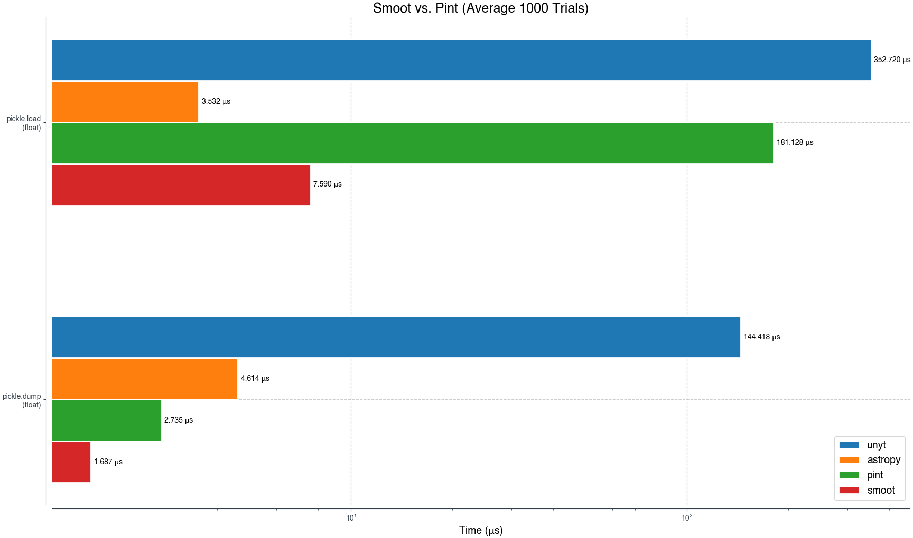

> [!CAUTION]
> Smoot is an early-stages project that has not reached a stable release. Bugs and missing features are common.


## Smoot: A fast dimensional analysis library for Python

Smoot is a [dimensional analysis](https://en.wikipedia.org/wiki/Dimensional_analysis) library written in Rust that allows numeric operations between and conversions to and from physical units.

It is designed as a drop-in replacement for [Pint](https://github.com/hgrecco/pint) with notably better performance. Smoot is 10x faster on average than Pint! See [Performance](#performance) below for more details.


## Basic Usage

Smoot supports Python 3.8+.

The API is identical to [Pint](https://github.com/hgrecco/pint)
```python
>>> import smoot
>>> units = smoot.UnitRegistry()
>>> 3 * units.meter + 4 * units.cm
<Quantity('3.04 meter')>
```

Smoot also supports numpy
```python
>>> [3, 4] * units.meter + [4, 3] * units.cm
<Quantity('[3.04, 4.03] meter')>
>>> np.sum(_)
<Quantity('7.07 meter')>
```

See [Usage](#usage) below for more.


## Installation

> [!CAUTION]
> Smoot is not yet available in prebuilt form on [PyPI](https://pypi.org/). You need to build the library from source.

Install the Rust toolchain for 1.86+. It is suggested to use [rustup](https://rustup.rs/).

Once you have Rust installed, you can use pip install to automatically build Smoot for your system:
```shell
pip install git+https://github.com/j-helland/smoot.git
```

Verify your installation with
```shell
python -c "import smoot"
```

### Building Wheels

One can easily build a redistributable [wheel](https://peps.python.org/pep-0427/) using the [Maturin](https://www.maturin.rs/) build system. Assuming that you already have `pip install maturin`, 
```shell
maturin build -r --strip --target <cpu-target>
```
where e.g. `aarch64-apple-darwin` is the correct choice for Apple silicon.


## Usage

### Unit Algebra

One of the most important features of Smoot is the ability to correctly track units throughout algebraic computations.
```python
>>> import smoot
>>> units = smoot.UnitRegistry()
>>> Q = units.Quantity

>>> e = Q(1, "gram") * units.c ** 2
>>> e
<Quantity('1 gram * speed_of_light ** 2')>

>>> e.to_root_units()
<Quantity('89875517873681760 (gram * meter ** 2) / second ** 2')>
```

### Unit Conversions

Smoot can convert compatible physical quantities.
```python
>>> Q(1, "meter").to("km")
<Quantity('0.001 kilometer')>

>>> Q(1, "meter").to("km").to("m")
<Quantity('1 meter')>
```

Moreover, Smoot will protect you from converting between physically incompatible units:
```python
>>> Q(1, "meter").to("gram")
Traceback (most recent call last):
...
"smoot.smoot".SmootError: Incompatible unit types meter and gram
```

Compatibility can be checked
```python
>>> Q(1, "meter").units.is_compatible_with("km")
True

>>> Q(1, "meter").u.is_compatible_with("gram")
False
```

### Unwrapping Quantities

You can extract values from quantities:
```python
>>> Q(1, "meter").magnitude
1.0

>>> Q(1, "meter").m
1.0
```

> [!NOTE]
> Smoot currently only supports floating point numerical data in its backend. As such, magnitudes will always return as floats (or `np.float64` in the case of arrays).

### Numpy Arrays

> [!CAUTION]
> The current implementation of Smoot requires copying numpy arrays to and from the underlying Rust code depending on the operation. This is reasonably fast for small arrays but the overhead can become expensive for large arrays (> 1k entries).
> Improving this situation is on the roadmap.

> [!CAUTION]
> While all [ufuncs](https://numpy.org/doc/stable/reference/ufuncs.html) are implemented, [higher order array functions](https://numpy.org/neps/nep-0018-array-function-protocol.html) are still a work in progress. Expect some inconsistencies here as Smoot stabilizes.

Smoot supports seamless integration with [Numpy](https://numpy.org/). Any iterable type passed into Smoot will be converted into a Numpy array.
```python
>>> units = smoot.UnitRegistry()
>>> q = [1, 2, 3] * units.meter
>>> q
<Quantity('[1, 2, 3] meter')>

>>> q.magnitude
array([1., 2., 3.])
```

Numpy functions are supported for all quantities, and units are retained when appropriate:
```python
>>> Q = units.Quantity
>>> np.sqrt(Q(2, "meter"))
<Quantity('1.4142135623730951 meter ** 0.5')>

>>> np.sqrt(Q([1, 2, 3], "meter"))
<Quantity('[1, 1.4142135623730951, 1.7320508075688772] meter ** 0.5')>

>>> np.sum(_)
<Quantity('4.146264369941973 meter ** 0.5')>
```

### Custom Units

> [!CAUTION]
> Smoot supports most of [Pint's unit definition syntax](https://pint.readthedocs.io/en/stable/advanced/defining.html) but some features are not yet implemented. 
> - Smoot does not support any `@` syntax like `@alias`, `@group`, `@context`, and `@system`.
> - Smoot does not support custom conversions e.g. `[gaussian_charge] -> [charge]: value / k_C ** 0.5`.

The existing unit registry can be extended with custom units
```python
>>> units = smoot.UnitRegistry()
>>> units.load_definitions("my_cool_unit = 10 * smoot")
>>> units.my_cool_unit
<Unit('my_cool_unit')>

>>> (1 * units.my_cool_unit).to(units.smoot)
<Quantity('10 smoot')>
```

Custom prefixes can also be defined, although they will only apply to newly defined units.
```python
>>> units = smoot.UnitRegistry()
>>> units.load_definitions("""
... my_prefix- = 2
... my_cool_unit = 10 * smoot
... """)

>>> units.my_cool_unit
<Unit('my_cool_unit')>

# Existing prefixes apply to custom units.
>>> units.kilomy_cool_unit
<Unit('kilomy_cool_unit')>

>>> units.my_prefixmy_cool_unit
<Unit('my_prefixmy_cool_unit')>

# But custom prefixes don't apply to existing units.
>>> units.my_prefixmeter
Traceback (most recent call last):
...
"smoot.smoot".SmootError: Invalid unit expression my_prefixmeter
```

It is also possible to create a unit registry from scratch containing only your custom unit definitions:
```python
>>> units = smoot.UnitRegistry(data="""
... my_prefix- = 2
... my_cool_unit = [my_dimension]
... my_cooler_unit = 10 * my_cool_unit
... """)

>>> units.my_cool_unit
<Unit('my_cool_unit')>

>>> units.my_cooler_unit
<Unit('my_cooler_unit')>

>>> units.my_cooler_unit.dimensionality
{'[my_dimension]': 1.0}
```


## Performance

> [!NOTE]
> All benchmark results were obtained on a MacBook Pro M4 Max using Python 3.8.20 and Pint 0.21.1. Results are similar for Python 3.13.2 and Pint 0.24.4.

Smoot typically outperforms [Pint](https://github.com/hgrecco/pint). Across all measured operations, Smoot averages (geometric mean) about 10x faster than Pint.

### Unit Conversions

Smoot averages about 15x faster unit conversions than Pint (excluding expression string parsing).

| Average (geometric) | Median           | Max     | Min    |
| ---                 | ---              | ---     | ---    |
| 15.370 +/- 1.885    | 14.730 +/- 6.973 |  44.938 |  7.570 |


| function         | conversion  | pint (μs) | smoot (μs) | speedup factor |
| ----             | ----------- | --------- | ---------- | -------------- |
| `m_as`           | `m -> km`   | 8.491     | 0.175      | **48.330**     |
| `m_as`           | `m -> m`    | 2.503     | 0.166      | **15.009**     |
| `to`             | `m -> km`   | 8.401     | 0.335      | **25.056**     |
| `to`             | `m -> m`    | 2.439     | 0.294      | **8.272**      |
| `ito`            | `m -> km`   | 1.371     | 0.175      | **7.798**      |
| `ito`            | `m -> m`    | 1.359     | 0.178      | **7.615**      |
| `to_root_units`  | `m`         | 2.965     | 0.243      | **12.157**     |
| `to_root_units`  | `km`        | 8.581     | 0.239      | **35.862**     | 
| `to_root_units`  | `newton`    | 10.393    | 0.343      | **30.248**     |
| `ito_root_units` | `m`         | 1.877     | 0.125      | **15.021**     |
| `ito_root_units` | `km`        | 1.871     | 0.123      | **15.128**     |
| `ito_root_units` | `newton`    | 1.568     | 0.197      | **7.947**      |


### Expression String Parsing

Smoot averages about 20x faster expression string parsing than Pint.

| Average (geometric) | Median | Max | Min |
| ---                 | ---    | --- | --- |
| 19.533 +/- 3.736 | 33.013 +/- 22.784 | 72.340 | 3.039 |


| function       | expression | pint (μs) | smoot (μs) | speedup factor |
| ----           | ----------- | --------- | ---------- | -------------- |
| `parse`          | `1 meter`                                                 |  30.124  | 0.836 | **36.018** |
| `parse`          | `1 km`                                                    |  58.016  | 0.801 | **72.340** |
| `parse`          | `1 meter/(second * gram)**2 + 3 meter/(second * gram)**2` | 154.955  | 3.085 | **50.221** |
| `parse` unit     | `meter`                                                   |   2.643  | 0.870 | **3.038** |
| `parse` unit     | `km`                                                      |  26.013  | 0.866 | **30.007** |
| `parse` unit     | `meter/(second * gram)**2`                                |   6.660  | 1.431 | **4.654** |


### Pickle

Smoot quantities pickle and unpickle faster than Pint. In particular, Smoot quantities unpickle about **14x** faster.



| function       |  pint (μs) | smoot (μs) | speedup factor |
| ----           |  --------- | ---------- | -------------- |
| `pickle.dump`  |  2.678     | 1.582      | **1.692**      |
| `pickle.load`  | 21.255     | 1.752      | **12.127**     |


### Arithmetic

Smoot quantities are about 18x faster at arithmetic than Pint.

| Average (geometric) | Median | Max | Min |
| ---                 | ---    | --- | --- |
| 18.136 +/- 2.188  | 14.167 +/- 4.710 | 63.203 | 3.309 |


| function       |  pint (μs) | smoot (μs) | speedup factor |
| ----           |  --------- | ---------- | -------------- |
| `eq`           |  1.258     | 0.131      |  **9.552**     |
| `add`          |  3.358     | 0.325      | **10.328**     |
| `iadd`         |  3.817     | 0.262      | **14.521**     |
| `sub`          |  3.237     | 0.345      |  **9.371**     |
| `isub`         |  3.740     | 0.270      | **13.812**     |
| `mul`          |  3.842     | 0.329      | **11.662**     |
| `imul`         |  4.342     | 0.264      | **16.436**     |
| `truediv`      |  4.061     | 0.333      | **12.181**     |
| `itruediv`     |  4.336     | 0.273      | **15.872**     |
| `floordiv`     |  5.192     | 0.349      | **14.851**     |
| `ifloordiv`    |  3.443     | 0.274      | **12.540**     |
| `mod`          |  4.406     | 0.334      | **13.172**     |
| `imod`         |  2.966     | 0.263      | **11.270**     |
| `math.pow`     |  8.411     | 0.381      | **22.055**     |
| `np.logaddexp` | 13.829     | 1.449      |  **9.541**     |
| `neg`          |  1.542     | 0.141      | **10.903**     |
| `math.floor`   |  4.883     | 0.171      | **28.469**     |
| `math.ceil`    |  4.797     | 0.168      | **28.506**     |
| `round`        |  1.627     | 0.190      |  **8.548**     |
| `abs`          |  1.517     | 0.174      |  **8.707**     |
| `math.sqrt`    |  4.804     | 0.080      | **59.460**     |
| `math.cos`     |  4.796     | 0.086      | **55.710**     |
| `math.sin`     |  4.834     | 0.085      | **56.756**     |
| `math.log`     |  4.921     | 0.101      | **48.306**     |
| `math.exp`     |  4.881     | 0.082      | **58.811**     |
| `math.isnan`   |  4.821     | 0.076      | **63.202**     |
| `math.isinf`   |  4.730     | 0.080      | **58.891**     |
| `np.sqrt`      |  6.224     | 1.881      |  **3.308**     |


### Load Times

Smoot loads unit definitions from disk about 5x faster than Pint. This means that Smoot's import time is notably faster than Pint.

| Average (geometric) | Median | Max | Min |
| ---                 | ---    | --- | --- |
| 5.297 +/- 1.078 | 5.304 +/- 0.282 | 5.586 |  5.022 |


| function       |  description | pint (ms)          | smoot (ms)         | speedup factor    |
| ----           |  ---------   | ----------         | --------------     | ---               |
| load units     | from file    | 159.242  | 28.505  | **5.586** |
| load units     | from cache   |  23.762  |  4.731  | **5.022** |
